# Client-Server Architecture Diagram

## System Overview

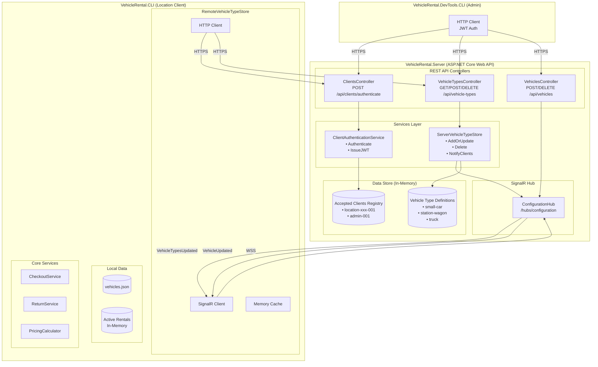

## Project Structure

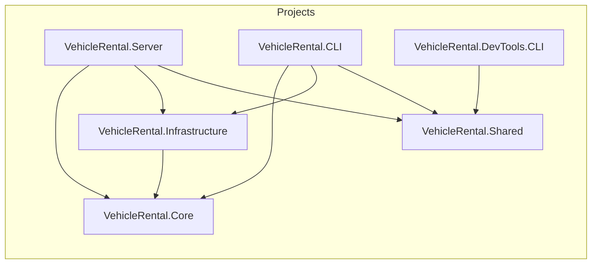

## REST API Endpoints

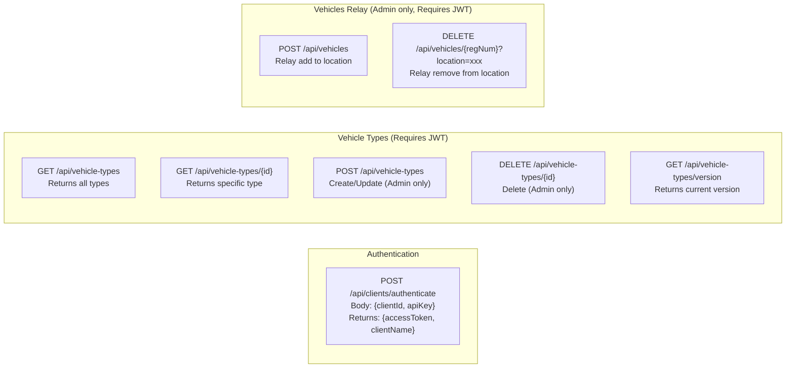

---

## Communication Flows

### 1. Client Startup (Initial Sync)

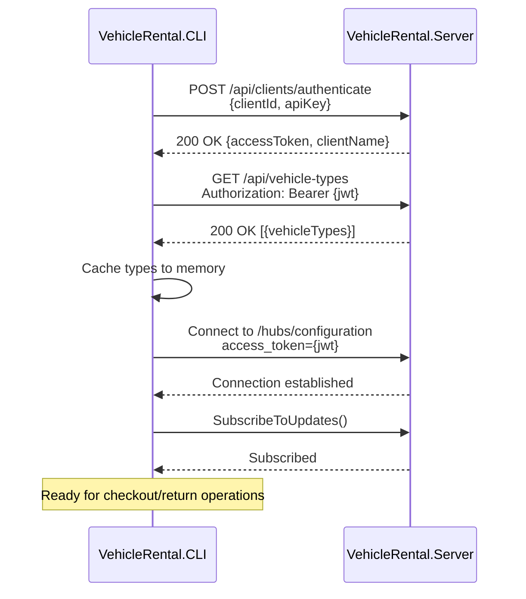

### 2. Vehicle Type Update (Admin Push to All Clients)

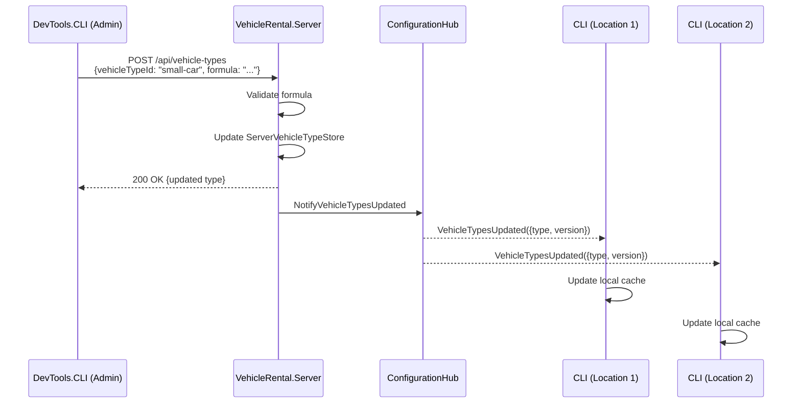

### 3. Vehicle Relay to Location

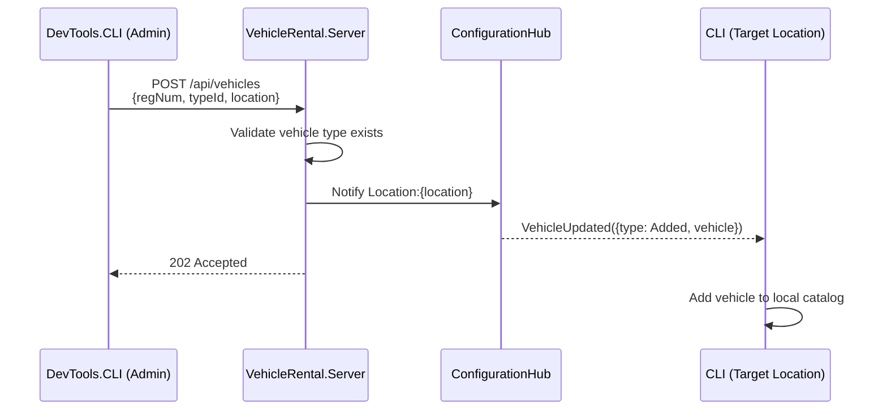

### 4. Price Freezing at Checkout

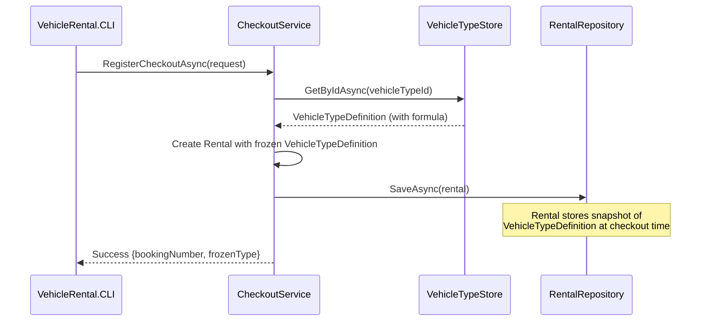

### 5. Return with Frozen Pricing

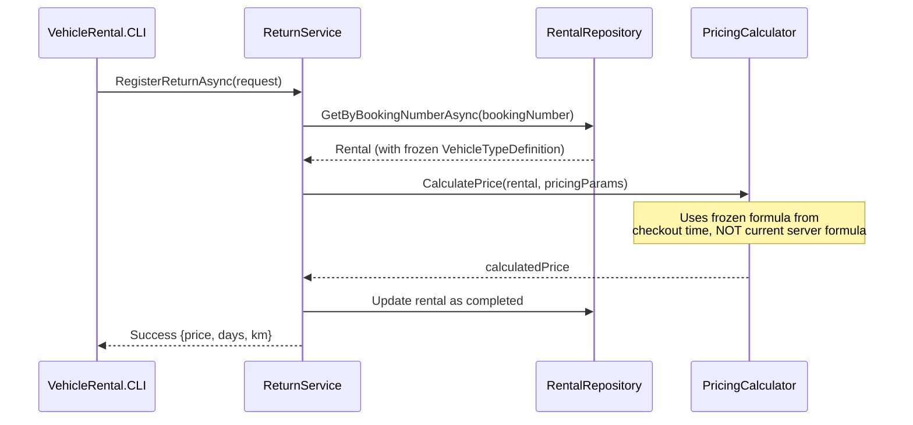

### 6. Offline Operation

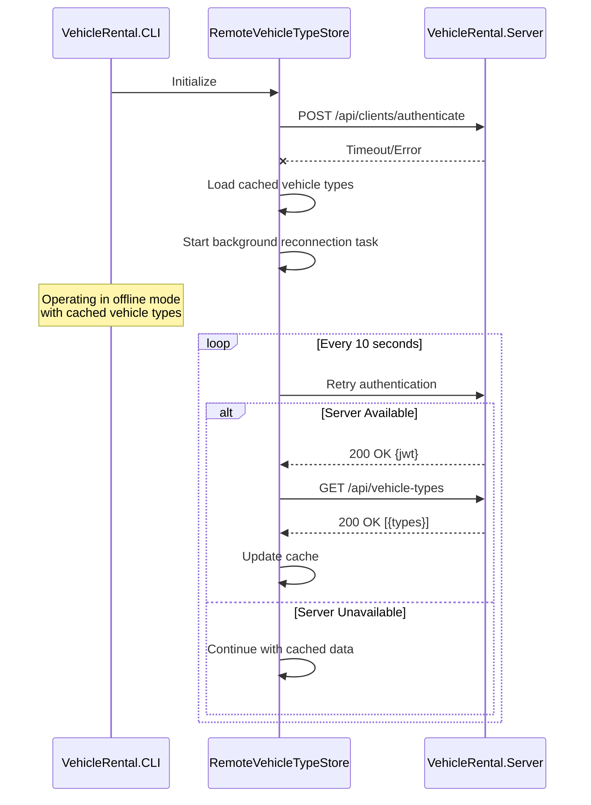

---

## Data Ownership Model

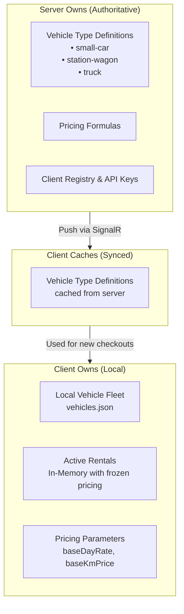

---

## Security Model

### Authentication Flow

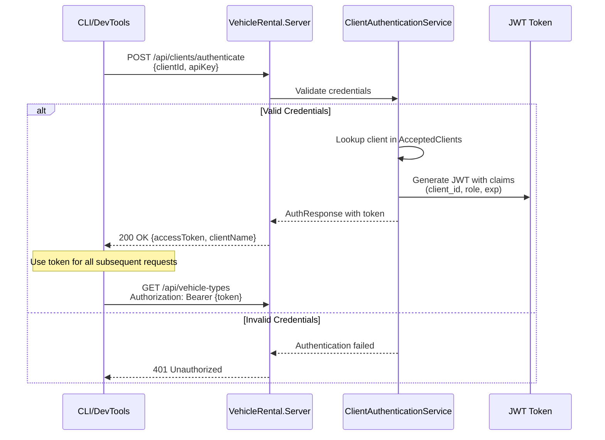

### Authorization Levels

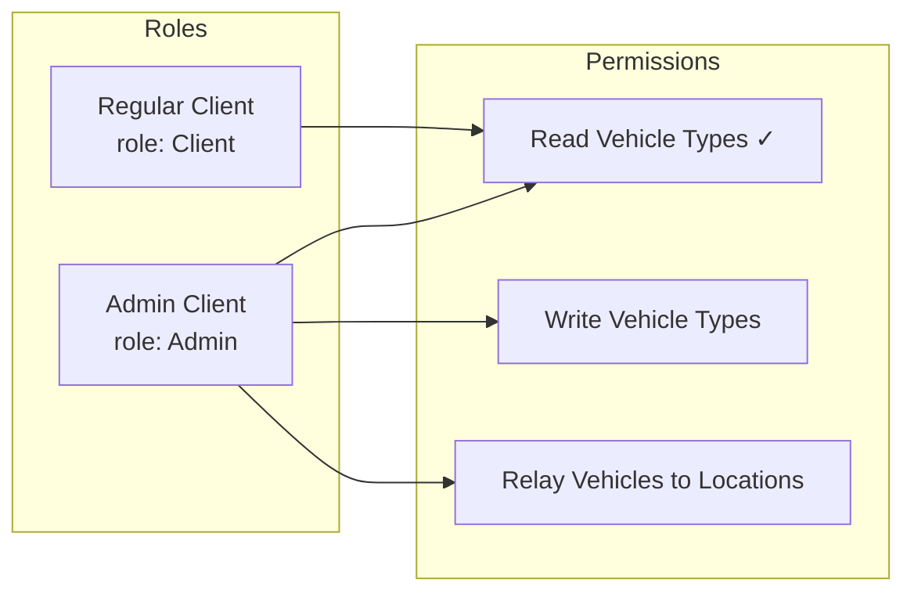

### Transport Security

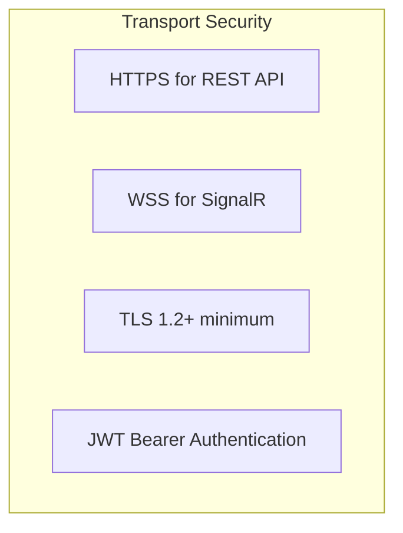
